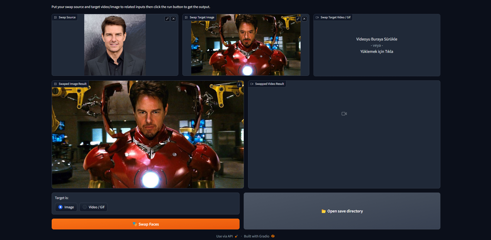

# FaceDancer WebUI
This project is aimed to create an easy to use user interface for FaceDancer, just drag and drop your images/videos, it'll handle the rest.

## Screenshots


## Requirements
- FaceDancer must be downloaded, follow the original installation guide [here](https://github.com/felixrosberg/FaceDancer/tree/main#installation)
- FaceDancer_config_c_HQ.h5 model, this was the model that gave me the best results (I am hoping to add model selector later on)


## Installation
- First install gradio
```shell
pip install gradio
```
- Run the app
```shell
python app.py
# Run with live reload using the following command if you want to edit the code
gradio app.py
```

## Todos
- [ ] (Move gif input to image box)
- [ ] (Add model selector)
- [ ] (Add live console output to UI)
- [ ] (Add options to save as png, jpg, mp4 etc.)
- [ ] (Prevent UI elements from getting to tall and crossing 100% height)