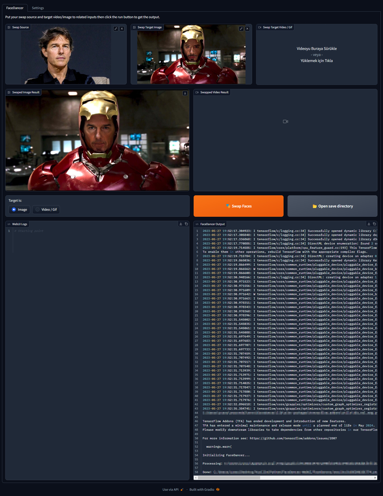

# FaceDancer WebUI
This project is aimed to create an easy to use user interface for FaceDancer, just drag and drop your images/videos, it'll handle the rest.

## Screenshots


## Requirements
- FaceDancer must be downloaded, follow the original installation guide [here](https://github.com/felixrosberg/FaceDancer/tree/main#installation)
- Any facedancer model you want


## Installation
1. Create a conda environment
```shell
conda create --name facedancer-webui
```
2. Activate conda environment
```shell
conda activate facedancer-webui
```
3. Install gradio
```shell
pip install gradio
```
4. Run the app
```shell
python app.py
# Run with live reload using the following command if you want to edit the code
gradio app.py
```

## Todos
- [ ] Create webui.bat to launch the webui automatically
- [ ] ~~Move gif input to image box~~ (Looks like it can't be done because of gradio inputting the selected gif as .png file)
- [x] Add webcam input
- [x] Add model selector
- [x] Add ~~live~~ console output to UI
- [x] Add options to save as png, jpg, mp4 etc.
- [ ] Add GFPGAN etc. for face enhancing?
- [ ] Fix webui logging, can be fixed by passing something like `{"value":f"{webUILogs.value}\nSource changed to {image_input_source.capitalize()}", "__type__": "update"}` to webUILogs block, but `{webUILogs.value}` always returns the original value
- [ ] Prevent UI elements from becoming too tall and crossing 100% height